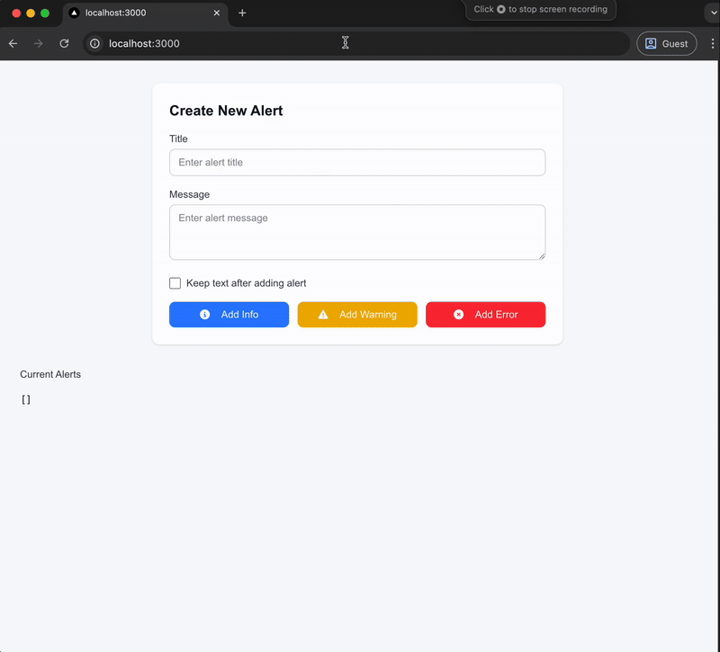

# Alert System with Zustand



This repository demonstrates the implementation of an alert system with global state management using [Zustand](https://github.com/pmndrs/zustand). The project is styled with [TailwindCSS](https://tailwindcss.com/), [ShadCN](https://shadcn.dev/), and [tailwind-animate](https://github.com/benface/tailwind-animate).

## Features

- **Global State Management**: Alerts are managed globally using Zustand.
- **Dynamic Alert Types**: Supports `info`, `warning`, and `error` alerts.
- **Customizable UI**: Styled with TailwindCSS and ShadCN for a modern and responsive design.
- **Animations**: Smooth animations for UI interactions using tailwind-animate.

## Installation

1. Clone the repository:
   ```bash
   git clone https://github.com/angjianhwee/alert-system.git
   cd alert-system
   ```

2. Install dependencies:
   ```bash
   npm install
   ```

3. Start the development server:
   ```bash
   npm run dev
   ```

4. Open your browser and navigate to `http://localhost:3000`.

## Usage

A simple usage example is included in the main application page. `src/pages/index.tsx` with a form to add alerts and a JSON display of the current alerts.

### Adding Alerts

1. Enter a title and message in the input fields.
2. Choose the type of alert (`info`, `warning`, or `error`) by clicking the respective button.
3. Optionally, check the "Keep text after adding alert" checkbox to retain the input values after adding an alert.

### Viewing Alerts

- All current alerts are displayed in JSON format at the bottom of the page.

## Using it in your project

Here’s a simple example of how to use the alert system:

```tsx
import { useAlertStore } from '@/store/alerts';

const ExampleComponent = () => {
  const { addAlert } = useAlertStore();

  const triggerAlert = () => {
    addAlert({
      type: 'info',
      title: 'Sample Alert',
      message: 'This is a sample alert message.',
      timestamp: new Date(),
    });
  };

  return (
    <button onClick={triggerAlert}>
      Trigger Alert
    </button>
  );
};

export default ExampleComponent;
```

## Technologies Used

- **React**: For building the user interface.
- **Zustand**: For global state management.
- **TailwindCSS**: For styling.
- **ShadCN**: For UI components.
- **tailwind-animate**: For animations.

## Folder Structure

```
Alert-System/
├── src/
│   ├── pages/
│   │   └── index.tsx  # Main application page
│   ├── components/    # Reusable UI components
│   └── store/         # Zustand store for managing alerts
├── public/            # Static assets
├── package.json       # Project dependencies and scripts
└── README.md          # Project documentation
```

## License

This project is licensed under the [MIT License](LICENSE).

## Dockerization

To run this application using Docker, follow these steps:

1.  **Build the Docker image**:
    ```bash
    docker build -t alert-system .
    ```

2.  **Run the Docker container**:
    ```bash
    docker run -p 3000:3000 alert-system
    ```

    The application will be accessible at `http://localhost:3000` in your browser.
